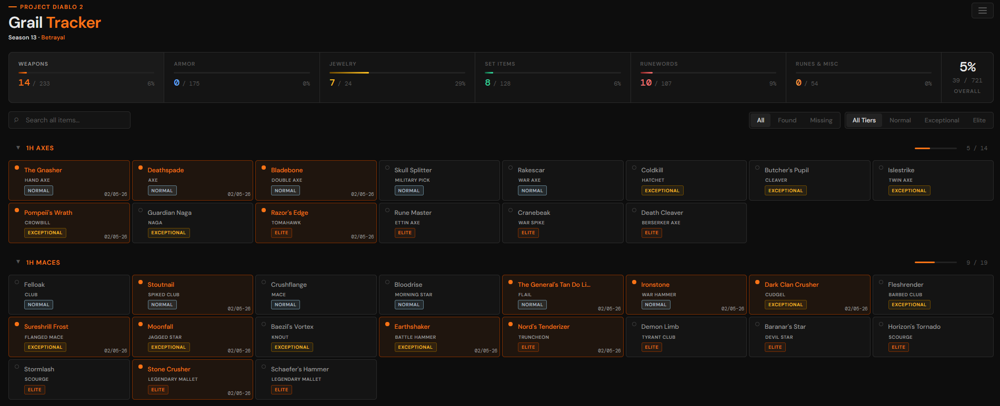
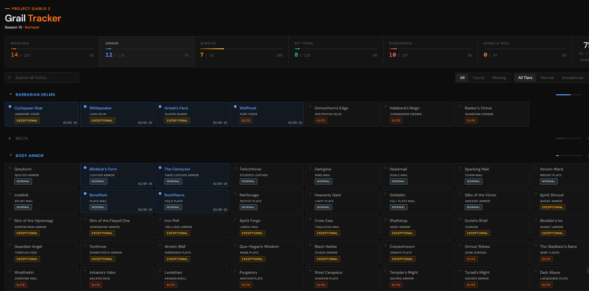
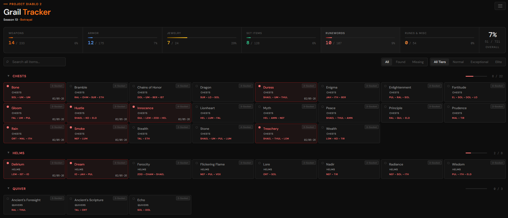

# PD2 Grail Tracker

Track your Project Diablo 2 Holy Grail progress. Click items as you find them, watch the bars fill up, try not to cry when Tyrael's Might never drops.

**[Use the Tracker](https://eletrifiedcanibaldeer.github.io/PD2-Grail-tracker/)** | [Download Offline Version](https://github.com/EletrifiedCanibalDeer/PD2-Grail-tracker/releases)

## Screenshots

<p align="center">
  
  
</p>

<p align="center">
  
  
</p>

## What's this?

The "Holy Grail" is finding every unique item, set item, runeword, rune, charm, jewel and misc item in the game at least once. This tracker helps you keep track of what you've found and what's still out there mocking you.

## Features

- Track 500+ items across 6 tabs: Weapons, Armor, Jewelry, Set Items, Runewords, Runes & Misc
- Runewords show socket count badge + rune recipe on each card
- Special drop source labels (DClone, Rathma, Imbue, Cow, Lucion) on relevant items
- Filter by tier (Normal / Exceptional / Elite)
- Filter by found / missing
- Search across all tabs simultaneously
- Progress bars per tab + overall percentage and count
- Season display in header (S13 · Betrayal)
- Share image — exports a PNG snapshot of your progress grid
- Export / import progress as JSON (found items + dates)
- Auto-saves in your browser (localStorage)
- Responsive layout — works on phone, tablet, desktop
- Build script to bundle into a single shareable HTML file

## How to use

### Quick Start (Standalone)

**Don't want to clone the repo?** Download the latest `pd2-grail-tracker-v[version].html` file from the [Releases](https://github.com/EletrifiedCanibalDeer/PD2-Grail-tracker/releases) page and open it in your browser. Everything works offline in a single file.

### Online Version

Visit **[eletrifiedcanibaldeer.github.io/PD2-Grail-tracker](https://eletrifiedcanibaldeer.github.io/PD2-Grail-tracker/)** to use the tracker directly in your browser. Your progress is saved locally in your browser's storage - no account needed, no data sent to any server.

### Development

Open `index.html` in your browser. Click items when you find them. That's it.

The controls at the top let you filter by found/missing and by tier. Search works across all tabs. Your progress saves automatically — but export a backup occasionally (burger menu → Export), browser data can get wiped.

### Building the Standalone File

To create a single self-contained HTML file:

```bash
npm run build
```

This produces `pd2-grail-tracker-[version].html` — a standalone file that bundles all CSS, JavaScript, and data. Perfect for sharing or offline use.

### GitHub Pages

This tracker is hosted on GitHub Pages and served directly from the repository root. To set up your own:

1. Go to your repository Settings → Pages
2. Set Source to "Deploy from a branch"
3. Select branch: `main` (or `master`) and folder: `/ (root)`
4. Save and wait a few minutes for deployment

Your tracker will be live at `https://[username].github.io/[repo-name]/`

### Re-enabling the editor

The inline data editor is kept in `editor/editor.js` but not loaded by default. See `editor/README.md` for instructions.

## Browser support

Any modern browser (Chrome, Firefox, Safari, Edge). Requires localStorage and ES6. No server needed.

## File structure

```
Root (application files):
  ├─ index.html                # main HTML structure
  ├─ styles.css                # all styling
  ├─ app.js                    # application logic
  ├─ grail-data.js             # consolidated item data with regions
  ├─ build.js                  # bundles into standalone HTML
  ├─ consolidate-data.js       # merges data files (if needed)
  └─ package.json              # project metadata & scripts

Screenshots/                   # screenshots for README
editor/                        # optional inline data editor
```

## Data

Based on PD2 **Season 13 — Betrayal**. Item data sourced from the [Project Diablo 2 Wiki](https://wiki.projectdiablo2.com/).

## localStorage keys

| Key | Contents |
|-----|----------|
| `pd2grail_v1` | Found item indices |
| `pd2grail_dates_v1` | Found timestamps |
| `pd2grail_data_v1` | Item data cache |
| `pd2grail_data_version` | Cache version flag (current: 11) |

## Known issues

- Progress stored locally — don't clear browser data without exporting first
- Incognito mode won't persist between sessions
- Google Fonts (DM Sans) requires an internet connection; the build script removes the font link for offline use

## Disclaimer

This project was built with assistance from Claude (AI). This is my first personal project using GitHub, so there may be rough edges. If you encounter issues or have suggestions, please open an issue and I'll do my best to address them.

## License

[CC BY-NC-SA 4.0](https://creativecommons.org/licenses/by-nc-sa/4.0/)

Use it, modify it, share it, host it. Don't sell it and give credit if you fork it.
